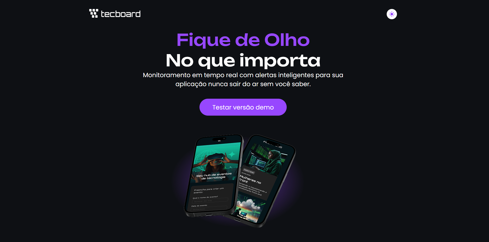

# Tecboard

🚀 Landing Page Tecboard

Projeto de landing page, com modo dark e light. desenvolvido durante meus estudos na plataforma Alura, com o objetivo de praticar JavaScript, responsividade, e manipulação do DOM. Nessa aula também foi ensinado controle de versão com Git

📸 Preview

🔗 Demo online

https://tgusbc.github.io/Tecboard/

🛠️ Tecnologias utilizadas

HTML5

CSS3

JavaScript
